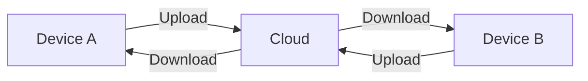

# Generate Spiral Curriculum HTML Guide

Instructions for creating comprehensive, progressively-detailed HTML documentation using the spiral curriculum pattern.

## What is Spiral Curriculum?

A **spiral curriculum** presents concepts at increasing levels of depth:
- **Level 1**: High-level overview for beginners
- **Level 2**: System architecture and patterns for intermediate users
- **Level 3**: Deep technical implementation details for advanced users

Users can read sequentially (building understanding) or jump to their level of expertise.

## When to Use This Format

Use spiral curriculum HTML guides when:
- Explaining complex technical systems to mixed-skill audiences
- Documenting architecture that has multiple abstraction layers
- Target audience includes experienced programmers unfamiliar with specific technologies (e.g., backend devs learning Flutter)
- Content benefits from visual diagrams and interactive navigation

**Don't use** for:
- Simple how-to guides (use markdown)
- API reference docs (use generated docs)
- Quick troubleshooting (use markdown with headers)

## Core Principles

### 1. Progressive Disclosure
Start high-level, add detail incrementally:
- **Level 1**: What it is, why it exists, basic concepts
- **Level 2**: How it works, architecture patterns, data flow
- **Level 3**: Implementation details, code deep-dives, platform specifics

### 2. Visual First
Use diagrams extensively:
- Mermaid diagrams for architecture, flows, sequences
- Comparison tables for feature matrices
- Color coding for visual distinction
- Icons and badges for quick scanning

### 3. Scannable Navigation
Provide multiple navigation aids:
- Sticky table of contents with hierarchical structure
- Anchor links throughout content
- "Back to top" buttons
- Visual level indicators (badges)

### 4. Code Examples with Context
- **Syntax highlighting**: Use Prism.js for multiple languages
- **Emphasize key parts**: Use `<strong>` or bold for important lines
- **Use ellipses**: Replace boilerplate with `...` to focus attention
- **Add comments**: Inline explanations in code blocks
- **Language labels**: Clearly mark code language (Dart, Swift, Bash, etc.)

## File Structure

### HTML Template Components

```html
<!DOCTYPE html>
<html lang="en">
<head>
    <meta charset="UTF-8">
    <meta name="viewport" content="width=device-width, initial-scale=1.0">
    <title>Topic Architecture Guide</title>

    <!-- Mermaid for diagrams -->
    <script src="https://cdn.jsdelivr.net/npm/mermaid@10/dist/mermaid.min.js"></script>

    <!-- Prism.js for syntax highlighting -->
    <link rel="stylesheet" href="https://cdnjs.cloudflare.com/ajax/libs/prism/1.29.0/themes/prism-tomorrow.min.css">
    <script src="https://cdnjs.cloudflare.com/ajax/libs/prism/1.29.0/prism.min.js"></script>
    <!-- Add language-specific Prism components as needed -->
    <script src="https://cdnjs.cloudflare.com/ajax/libs/prism/1.29.0/components/prism-dart.min.js"></script>
    <script src="https://cdnjs.cloudflare.com/ajax/libs/prism/1.29.0/components/prism-swift.min.js"></script>

    <style>
        /* CSS here - see Styling section */
    </style>
</head>
<body>
    <div class="container">
        <header>
            <h1>🔄 Topic Architecture Guide</h1>
            <p>Clear subtitle explaining scope</p>
            <p>Target audience indicator</p>
        </header>

        <nav id="nav">
            <h2>📋 Table of Contents</h2>
            <ul>
                <li><a href="#overview">Level 1: High-Level Overview</a></li>
                <li class="level-2"><a href="#subsection">Subsection</a></li>
                ...
            </ul>
        </nav>

        <!-- Level 1 Section -->
        <section id="overview">
            <h1>Level 1: High-Level Overview <span class="level-indicator level-1">Beginner</span></h1>
            ...
        </section>

        <!-- Level 2 Section -->
        <section id="architecture">
            <h1>Level 2: System Architecture <span class="level-indicator level-2">Intermediate</span></h1>
            ...
        </section>

        <!-- Level 3 Section -->
        <section id="implementation">
            <h1>Level 3: Implementation Details <span class="level-indicator level-3">Advanced</span></h1>
            ...
        </section>

        <footer>
            <p>Generated for Project • Last updated: Date</p>
        </footer>
    </div>

    <script>
        // Initialize Mermaid
        mermaid.initialize({ startOnLoad: true });

        // Smooth scrolling
        document.querySelectorAll('a[href^="#"]').forEach(anchor => {
            anchor.addEventListener('click', function (e) {
                e.preventDefault();
                const target = document.querySelector(this.getAttribute('href'));
                if (target) {
                    target.scrollIntoView({ behavior: 'smooth', block: 'start' });
                }
            });
        });
    </script>
</body>
</html>
```

## Styling Guidelines

### Color Scheme
Use a consistent, professional palette:
```css
:root {
    --primary-color: #2c3e50;      /* Dark blue-gray */
    --secondary-color: #3498db;    /* Bright blue */
    --accent-color: #e74c3c;       /* Red for warnings */
    --success-color: #27ae60;      /* Green for success */
    --warning-color: #f39c12;      /* Orange for warnings */
    --bg-color: #ecf0f1;           /* Light gray background */
}
```

### Typography
- **Body font**: System font stack (`-apple-system, BlinkMacSystemFont, 'Segoe UI'...`)
- **Code font**: `'Courier New', monospace`
- **Line height**: 1.6 for readability
- **Font sizes**:
  - H1: 2.2em
  - H2: 1.8em
  - H3: 1.4em
  - Body: 1em (16px base)

### Navigation (TOC)
- **Position**: Regular (not sticky - sticky TOCs can occlude content)
- **Styling**: Clean, with clear hierarchy
- **Link colors**: Darker for better contrast (#1a5490 for top-level)
- **Hover effect**: Background highlight + color change
- **Indentation**: 20px per level

### Callouts
Use colored callouts for important information:
- **Info** (blue): Tips, explanations, "For non-X devs" context
- **Warning** (orange): Important gotchas, common mistakes
- **Danger** (red): Critical requirements, data loss risks
- **Success** (green): Best practices, recommended approaches

### Code Blocks
- **Background**: Dark (`#2d2d2d`)
- **Syntax highlighting**: Prism.js with `prism-tomorrow` theme
- **Padding**: 15px
- **Border radius**: 5px
- **Language labels**: Use `<code class="language-X">` for Prism

## Content Structure

### Level 1: High-Level Overview

Start with basics:

```markdown
## What is [Topic]?
- Brief description (1-2 paragraphs)
- Core purpose and problems it solves
- Key capabilities (bulleted list)

## [Comparison/Options]
- Table comparing approaches/providers/implementations
- Platform badges (iOS, Android, Cross-platform)
- Trade-offs clearly stated

## Core Principles
- Callout boxes for critical principles
- Visual diagrams showing basic flow
```

**Example diagram**:


### Level 2: System Architecture

Explain how it works:

```markdown
## [Component] Abstraction
- Architecture pattern used (Strategy, Observer, etc.)
- Interface/protocol definition (simplified code)
- Class diagram showing relationships

## System Flow
- Sequence diagram showing interaction
- Step-by-step breakdown
- Data structure examples

## [Key Subsystem]
- Coordinator/orchestrator role
- How components interact
```

**Example code** (simplified):
```dart
// Emphasize key parts with bold
abstract class SyncProvider {
  Future<void> **uploadFile**({...});
  Future<void> **downloadFile**({...});
  ...  // Use ellipses for non-essential parts
}
```

### Level 3: Deep Dives

Provide implementation details:

```markdown
## [Provider] Deep Dive
- Full authentication flow (sequence diagram)
- API integration details
- Error handling patterns
- Platform-specific code (Swift, Kotlin, etc.)

## [Advanced Feature]
- Complete code examples
- Edge cases and gotchas
- Performance considerations
- Testing strategies
```

**Example** (platform-specific):
```swift
// Swift implementation
func uploadFile(...) {
    // **Coordinated write required**
    coordinator.coordinate(writingItemAt: url) { coordUrl in
        try data.write(to: coordUrl, options: .atomic)
    }
}
```

## Mermaid Diagrams

### Best Practices

Follow `@gjdutils/docs/instructions/GENERATE_MERMAID_DIAGRAM.md`:

1. **Use appropriate diagram types**:
   - `graph LR/TB` - Simple flows
   - `sequenceDiagram` - Multi-actor interactions
   - `classDiagram` - Object relationships
   - `graph TB` - Complex decision trees

2. **Simplify linear flows**: Collapse sequential steps into one box with bullets
   ```mermaid
   Process[Process Flow:<br/>• Step 1<br/>• Step 2<br/>• Step 3]
   ```

3. **Color code by system/state**:
   ```mermaid
   style Success fill:#27ae60,color:#fff
   style Error fill:#e74c3c,color:#fff
   ```

4. **Avoid syntax issues**:
   - Escape HTML entities: `&lt;` `&gt;` not `<` `>`
   - Don't use `~` for generics (causes errors)
   - Use spaces for types: `Future void` not `Future~void~`

5. **Add icons for clarity**: 📱 🌐 🔄 ☁️ ⚠️

### Embedding Diagrams

```html
<div class="mermaid">
    sequenceDiagram
        participant User
        participant App
        participant Cloud

        User->>App: Action
        App->>Cloud: Upload
        Cloud-->>App: Success
</div>
```

## Code Presentation

### Syntax Highlighting Setup

Include Prism.js with needed languages:

```html
<link rel="stylesheet" href="https://cdnjs.cloudflare.com/ajax/libs/prism/1.29.0/themes/prism-tomorrow.min.css">
<script src="https://cdnjs.cloudflare.com/ajax/libs/prism/1.29.0/prism.min.js"></script>
<script src="https://cdnjs.cloudflare.com/ajax/libs/prism/1.29.0/components/prism-dart.min.js"></script>
```

### Code Block Formatting

**DO**:
```html
<pre><code class="language-dart">
// <strong>Key function</strong>
Future<void> **uploadFile**({
  required String localPath,
  required String remotePath,
}) async {
  // Check authentication
  if (!await isAuthenticated()) {
    throw NotAuthenticatedException();
  }

  // <strong>Upload with conflict detection</strong>
  await provider.upload(...);
}
</code></pre>
```

**DON'T** (too much boilerplate):
```dart
class VeryLongClassName extends SomeBaseClass implements MultipleInterfaces {
  final Logger _logger;
  final Config _config;
  final SomeOtherDependency _dep;

  VeryLongClassName({
    required Logger logger,
    required Config config,
    required SomeOtherDependency dep,
  }) : _logger = logger,
       _config = config,
       _dep = dep;

  // ... pages of setup code before the important part
}
```

### Ellipses Usage

Replace non-essential code with `...`:

```dart
class AuthService {
  // <strong>OAuth flow</strong>
  Future<void> authenticate() async {
    final challenge = _generateChallenge();
    final authCode = await _openBrowser(...);
    final tokens = await _exchangeCode(authCode, challenge);
    await _storeTokens(tokens);  // <strong>Store securely</strong>
  }

  // Helper methods
  String _generateChallenge() { ... }
  Future<String> _openBrowser(...) { ... }
  ...
}
```

### Language-Specific Examples

Always label language clearly:

```html
<!-- Dart -->
<pre><code class="language-dart">
Future<void> example() async { ... }
</code></pre>

<!-- Swift -->
<pre><code class="language-swift">
func example() async throws { ... }
</code></pre>

<!-- Bash -->
<pre><code class="language-bash">
flutter run -d iphone
</code></pre>
```

## Visual Elements

### Comparison Tables

```html
<table class="comparison-table">
    <thead>
        <tr>
            <th>Feature</th>
            <th>Option A</th>
            <th>Option B</th>
        </tr>
    </thead>
    <tbody>
        <tr>
            <td><strong>Platform</strong></td>
            <td>iOS, Android</td>
            <td>iOS only</td>
        </tr>
    </tbody>
</table>
```

### Badges

```html
<span class="badge badge-ios">iOS</span>
<span class="badge badge-android">Android</span>
<span class="badge badge-cross-platform">Cross-Platform</span>

<span class="level-indicator level-1">Beginner</span>
<span class="level-indicator level-2">Intermediate</span>
<span class="level-indicator level-3">Advanced</span>
```

### Callout Boxes

```html
<div class="callout callout-danger">
    <strong>🚨 Critical:</strong> Never do X without Y. Data loss risk.
</div>

<div class="callout callout-info">
    <strong>💡 For non-Flutter devs:</strong> Future&lt;T&gt; is like Promise&lt;T&gt; in JavaScript.
</div>

<div class="callout callout-warning">
    <strong>⚠️ Important:</strong> This requires iOS 14+.
</div>

<div class="callout callout-success">
    <strong>✅ Best Practice:</strong> Always validate input before processing.
</div>
```

## Workflow

### 1. Research & Outline

Before writing:
1. Read all relevant documentation in `docs/reference/` and `docs/planning/`
2. Examine actual code implementations
3. Create hierarchical outline with 3 levels
4. Identify key diagrams needed

### 2. Create Structure

```bash
# Create HTML file in docs/
touch docs/topic_architecture_guide.html
```

Start with template, add:
- Header with clear title and subtitle
- Table of contents structure (populate after outlining)
- Section placeholders for each level

### 3. Write Content (Level by Level)

**Level 1** (30% of content):
- Write overview sections
- Create basic flow diagrams
- Add comparison tables
- Include core principles callouts

**Level 2** (40% of content):
- Document architecture patterns
- Add sequence diagrams
- Show data structures
- Explain system flows

**Level 3** (30% of content):
- Deep dive into implementations
- Add platform-specific code
- Document edge cases
- Include advanced patterns

### 4. Add Visuals

For each section:
1. Identify what needs visualization
2. Create Mermaid diagrams inline
3. Add color coding
4. Include icons for clarity
5. Ensure diagrams are self-contained (understandable without surrounding text)

### 5. Enhance Code Examples

For each code block:
1. Add language class: `class="language-X"`
2. Simplify: Remove boilerplate, use `...`
3. Emphasize: Bold or `<strong>` key parts
4. Comment: Add inline explanations
5. Test: Verify syntax highlighting renders correctly

### 6. Review & Polish

Checklist:
- [ ] All links work (test anchor navigation)
- [ ] Code syntax highlights correctly
- [ ] Mermaid diagrams render without errors
- [ ] Tables are readable and aligned
- [ ] Callouts use appropriate colors
- [ ] Mobile responsive (test at 768px)
- [ ] Consistent terminology throughout
- [ ] No orphaned sections (all referenced in TOC)

### 7. Test & Open

```bash
# Open in browser
open docs/topic_architecture_guide.html

# Check for errors in browser console
# Verify:
# - Mermaid renders
# - Prism highlights code
# - Anchor links scroll smoothly
# - TOC is readable and navigable
```

## Common Patterns

### "For non-X devs" Context

When explaining framework-specific concepts:

```html
<div class="callout callout-info">
    <strong>💡 For non-Flutter devs:</strong>
    <code>Future&lt;T&gt;</code> is Dart's equivalent to:
    <ul>
        <li><code>Promise&lt;T&gt;</code> in JavaScript</li>
        <li><code>Task&lt;T&gt;</code> in C#</li>
        <li><code>CompletableFuture&lt;T&gt;</code> in Java</li>
    </ul>
</div>
```

### Cross-References

Link to related sections:

```html
<p>
    For details on conflict detection, see
    <a href="#conflict-detection">Conflict Detection</a>.
</p>
```

### Error Handling Tables

```html
<table class="comparison-table">
    <thead>
        <tr>
            <th>Error Type</th>
            <th>Provider A</th>
            <th>Provider B</th>
            <th>Handling</th>
        </tr>
    </thead>
    <tbody>
        <tr>
            <td><strong>Not Authenticated</strong></td>
            <td>401 Unauthorized</td>
            <td>SDK throws error</td>
            <td>Prompt re-login</td>
        </tr>
    </tbody>
</table>
```

### Implementation Comparison

Show both approaches side-by-side:

```html
<h3>Dropbox Approach</h3>
<pre><code class="language-dart">
// HTTP API call
await dio.post('/files/upload', data: stream);
</code></pre>

<h3>iCloud Approach</h3>
<pre><code class="language-swift">
// Platform channel to Swift
coordinator.coordinate(writingItemAt: url) { ... }
</code></pre>
```

## Output Location

Save HTML guides in:
- `docs/` - Top-level architecture guides
- `docs/guides/` - Topic-specific guides (if directory exists)

Name format: `{topic}_architecture_guide.html`

Examples:
- `sync_architecture_guide.html`
- `audio_pipeline_guide.html`
- `ml_integration_guide.html`

## Quality Checklist

Before finalizing:

**Content**:
- [ ] Three distinct levels of depth
- [ ] Concepts build progressively (no forward references in L1)
- [ ] All technical terms defined on first use
- [ ] Code examples are accurate and tested
- [ ] No outdated information

**Visuals**:
- [ ] At least 3-5 Mermaid diagrams
- [ ] Diagrams follow Mermaid best practices
- [ ] Color coding is consistent
- [ ] Icons used meaningfully
- [ ] Tables are clear and scannable

**Code**:
- [ ] Syntax highlighting works
- [ ] Simplified with ellipses where appropriate
- [ ] Key parts emphasized (bold/strong)
- [ ] All code blocks labeled with language
- [ ] No syntax errors

**Navigation**:
- [ ] TOC includes all sections
- [ ] Anchor links work
- [ ] Smooth scrolling enabled
- [ ] Appropriate contrast for readability
- [ ] Mobile responsive

**Polish**:
- [ ] Consistent terminology
- [ ] No typos or grammar errors
- [ ] Professional tone
- [ ] Clear audience indicator
- [ ] Footer with date/project info

## Examples

### Good Example Structure

**Level 1** - What is OAuth?
- Brief: Authentication protocol for delegated access
- Diagram: User → App → Provider → App → User
- Table: OAuth 1.0 vs 2.0 vs PKCE
- Principles: Never store passwords, use tokens

**Level 2** - How OAuth Works
- Flow diagram: Authorization Code Grant with PKCE
- Code: Abstract interface for OAuth provider
- Explanation: Why PKCE for mobile apps

**Level 3** - Implementation Details
- Full code: Dropbox OAuth setup with AppAuth
- Platform code: iOS redirect URI handling
- Error handling: Token refresh, expiry, revocation
- Testing: Manual test scenarios

### Bad Example (Too Flat)

❌ **Don't dump everything at once**:
- All OAuth variants explained upfront
- Complete code before concepts
- Platform specifics before understanding flow
- No visual hierarchy

## Tips

1. **Start simple**: Level 1 should be understandable to someone unfamiliar with the domain
2. **Visualize flows**: Use sequence diagrams for multi-step processes
3. **Compare visually**: Tables for feature matrices, side-by-side code for alternatives
4. **Emphasize critical parts**: Use callouts for data loss risks, security issues
5. **Test on target audience**: Have someone unfamiliar with the tech read Level 1
6. **Keep diagrams simple**: One concept per diagram
7. **Use real code**: Adapted from actual implementation, not invented examples
8. **Cross-link extensively**: Help users jump to related concepts
9. **Update regularly**: Keep in sync with code changes

## Related Instructions

- `@gjdutils/docs/instructions/GENERATE_MERMAID_DIAGRAM.md` - Diagram creation
- `@gjdutils/docs/instructions/WRITE_EVERGREEN_DOC.md` - Markdown documentation
- `@gjdutils/docs/instructions/WRITE_DEEP_DIVE_AS_DOC.md` - Technical deep dives
